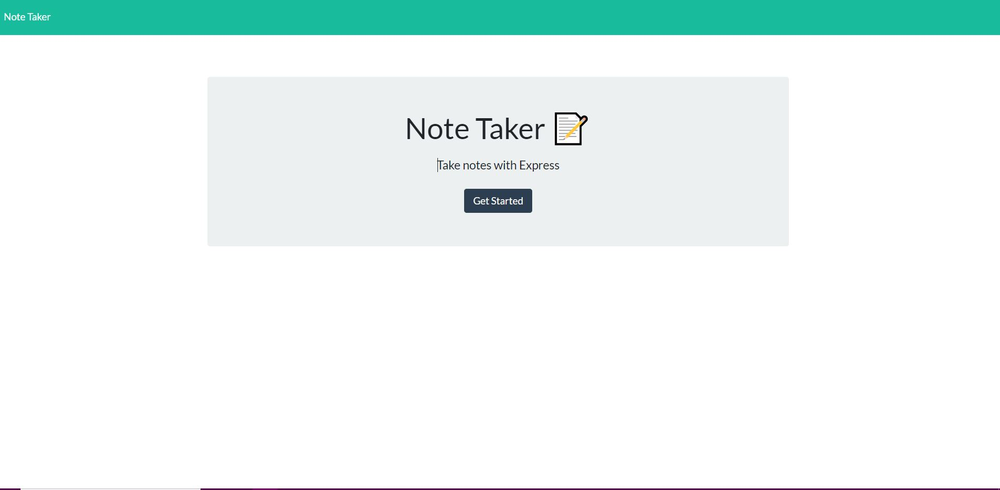
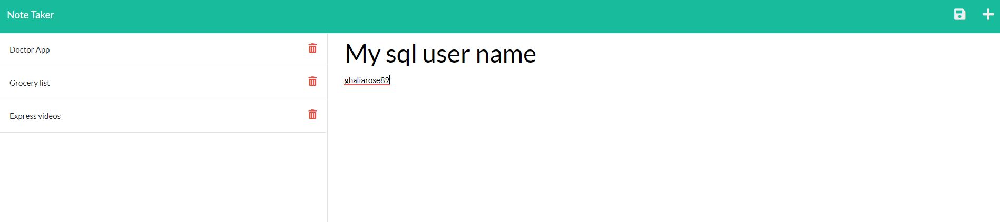

# Note Taker 

## Purpose:
 Note Taker web app can be used to write and save notes.

### Description:
* WHEN opening the Note Taker
* The app presented with a landing page with a link to a notes page
* Clicking on the link to the notes page will
* Display a page with existing notes listed in the left-hand column, 
plus empty fields to enter a new note title and the   note’s text in the right-hand column
* WHEN  entering a new note title and the note’s text
* Save icon will appear in the navigation at the top of the page
* Clicking on the Save icon
* the new note that entered is saved and appears in the left-hand column with the other existing notes
* Clicking on an existing note in the list in the left-hand column
* note appears in the right-hand column
* clicking on the Write icon in the navigation at the top of the page
* empty fields will display to enter a new note title and the note’s text in the right-hand column.

## instructions : 
* Install the npm package , then enter 'node server' OR
* visit the deployed page (https://note-taker2022.herokuapp.com/)

## Usage:

Press on GetStarted to add your notes.

Clicking on the Save icone will save your note as the snip above.
Clicking on the Delete icone will delete the note that attached to it as the snip above.

### Contribution:
Made with ❤️️ by Ghalia Sami. 
For more information, Please contact me.
Email: ghaliarose89@gmail.com

### ©️ [2021] [Ghalia Sami]

